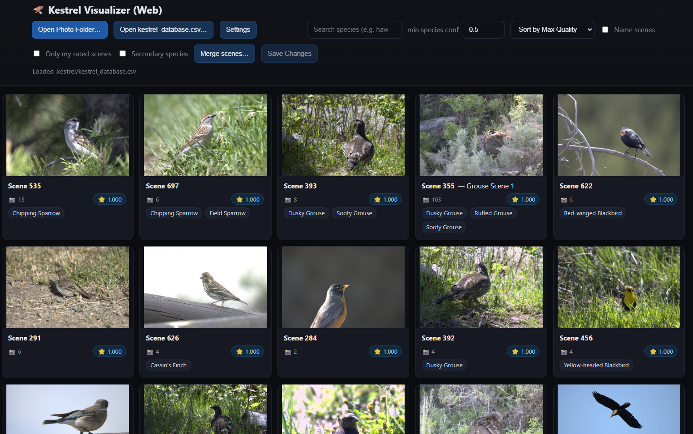
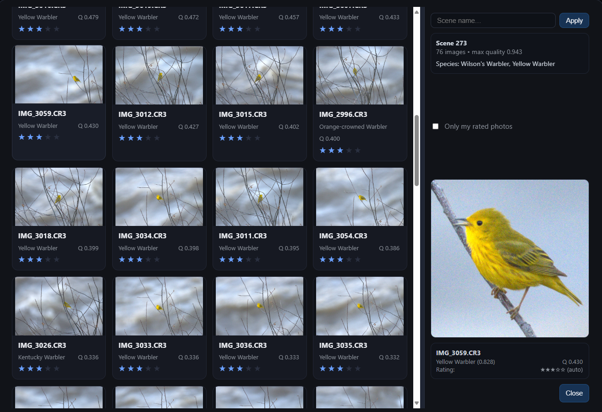
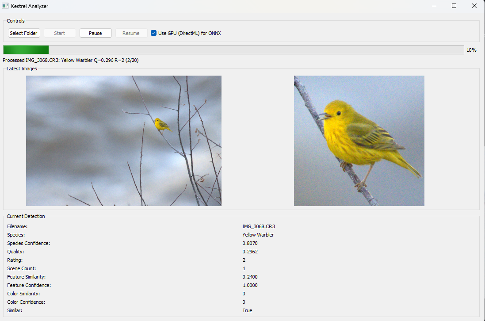
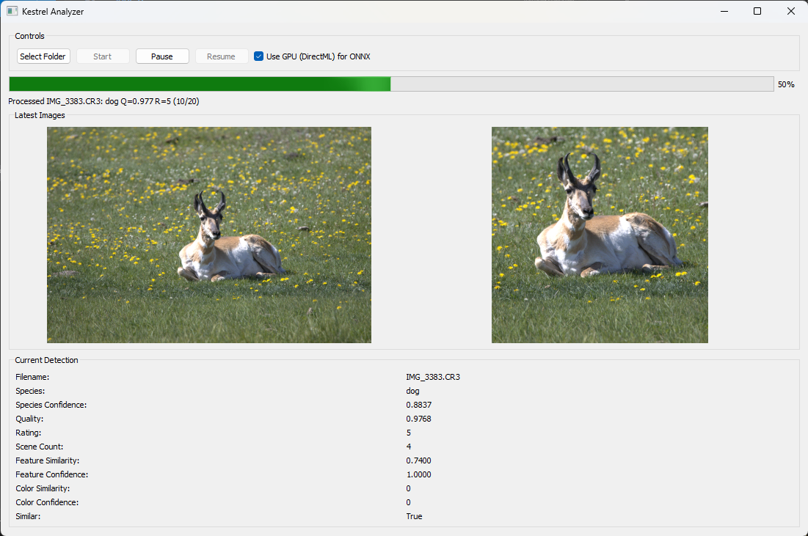

# Project Kestrel 🦅

A Machine Learning-powered bird photography analysis and curation system that automatically detects, classifies, and evaluates bird images from RAW photography collections.


[Donate](https://www.paypal.com/donate/?hosted_button_id=CXH4FE5AKZD3A) | [Visit Projectkestrel.org](https://projectkestrel.org)

## At a Glance

Are you a bird photographer? Do you take hundreds or thousands of bird photos, often in bursts? Project Kestrel scans through your bird photos, grouping them by scene, finding the birds in each photo, and sorting them by the sharpness of the **bird**. 

After Kestrel is done scanning, run the visualizer tool to instantly discover your favorite photos. As you drag your mouse across your photos, you'll see a zoom-in crop on the bird, so you can focus on evaluating the bird's pose or actions, rather than painstakingly finding images with slightly better sharpness.

* **NEW!** Complete overhaul of the folder visualizer, now using a web-based framework that is extremely fast and responsive.
* **NEW!** No more command lines needed! Kestrel's analyzer has a new GUI that shows you the analysis progress.
* **NEW!** Rudimentary support for non-bird images. Use Kestrel to analyze other wildlife species! Note: this feature is in beta, and wildlife categories will not be accurate.
* **NEW!** Bird Family Classification. Kestrel may understand that your bird is of one specific family (ex. a Sparrow), but unsure which exact species it is (Fox Sparrow or Song Sparrow). Kestrel now supports family classification, so you can search by "Sparrow sp." for these situations.

## Gallery

Kestrel sorts all of your bird photos into scenes.


Simply double-click on a scene to view all your photos, sorted by quality! Find a pose you like? Double-click to open in darktable or whatever photo software you prefer.


Kestrel has sorted your photos from sharp to blurry. No more time painstakingly reviewing each bird!


You can even search by bird species! (Note: Species detection is experimental and may be incorrect.)


**NEW!** Kestrel's analyzer is more intuitive than ever before! Just open the GUI, pick your bird photo folder, and hit "Start!"


## 🌟 Features

- **🔍 Automatic Bird Detection**: Kestrel will find exactly where the bird is in your photo
- **🐦 Species Classification**: (BETA) Kestrel will guess the bird species, allowing you to search by species!
- **⭐ Quality Assessment**: Sort your photos by image quality, from sharp to blurry! Kestrel will assign quality scores using a custom Machine Learning model.
- **📂 Smart Organization**: Groups similar images or bursts of photos into scenes to easily compare all images within a scene!
- **🖼️ Interactive Visualizer**: Responsive and fast. Shows close-ups of each bird. Double-click to open in your favorite editor (darktable is supported for now)
- **📸 RAW File Support**: Processes CR2, CR3, NEF, ARW, DNG, and other RAW formats
- **🔗 External Tool Integration**: Direct integration with Darktable so you can stop sorting and start editing!

## 🚀 Quick Start

### Prerequisites

- Python 3.12+
- Windows OS (primary support, macOS support is planned)
- ImageMagick (for RAW file reading via Wand)

To install ImageMagick, visit their [download page](https://imagemagick.org/script/download.php) and install the latest Q8 dynamic release.

For Debian(or Debian Based Distros),
```
sudo apt update
sudo apt install imagemagick
```

### Installation

1. Clone the repository:
```bash
git clone https://github.com/SanjaySoniLV/ProjectKestrel.git
cd ProjectKestrel
```

2. Install dependencies:
```bash
pip install -r requirements.txt
```

### Usage

#### 1. Analyze a Photo Directory

First open the analyzer.

```bash
export QT_QPA_PLATFORM=wayland
python analyzer/gui_app.py
```

Select a folder and hit start. The script will:
- Process each image to detect birds, classify species, and assess quality
- Generate a database of results in `.kestrel/kestrel_database.csv`
- Create export JPEGs and cropped bird images



> Note: The script will take some time to run. All progress is saved automatically. If you encounter any errors, try re-running the script, and Kestrel will continue where it left off.

> Note: Kestrel comes with a set of test images. Simply open the `test_imgs` folder and hit Start. 

CLI (headless) option:
```bash
python analyzer/cli.py "C:\\path\\to\\photos" --no-gpu
```

#### 2. Visualize Results

Launch the interactive visualizer to browse your analyzed photos:

```bash
python visualizer/visualizer.py
```

Open the folder that you analyzed to explore its contents and Kestrel's analysis:


Features of the visualizer:
- **Scene View**: Browse grouped similar images
- **Species Search**: Filter by bird species keywords
- **Quality Sorting**: Images automatically sorted by quality score
- **Detailed View**: Examine individual images with metadata
- **External Tools**: Open original files or simply double-click to launch Darktable

## 📊 How It Works

### 1. Bird Detection
- Uses PyTorch's Mask R-CNN ResNet50 FPN v2 model
- Detects and segments birds in images
- Generates precise masks to ensure image quality is assessed on bird pixels only, not background pixels.

### 2. Species Classification
- A custom machine learning model was trained for bird species identification for North American birds.
- Improvements to classification are planned.

### 3. Quality Assessment
- A custom machine learning model was trained to analyze the quality of the images.
- Factors in noise, motion blur, out-of-focus images, and other artifacts into one score.
- Only evaluates image regions corresponding to the bird, NOT any branches, backgrounds, or other regions.
- Quality scores are used to rank images within a scene by sharpness.

### 4. Scene Grouping
- A custom image similarity algorithm was developed to identify images that belong to the same scene.
- Bursts are automatically grouped together, allowing their relative quality to be ranked with ease.

## 🗂️ Project Structure

```
ProjectKestrel/
├── analyzer/                 # Analyzer app (GUI + CLI + core pipeline)
│   ├── gui_app.py            # PyQt GUI entry
│   ├── cli.py                # CLI entry
│   ├── main.py               # GUI entrypoint wrapper
│   ├── models/               # AI model files
│   └── kestrel_analyzer/     # Core pipeline + ML wrappers
├── visualizer/               # Visualizer app (local web server)
│   ├── visualizer.py         # Server entry
│   └── visualizer.html       # Web UI
├── packaging/                # PyInstaller specs for .exe builds
└── README.md
```

## 🎯 Supported File Formats

Kestrel's quality scoring model is trained on RAW images, and may not work as well for JPG images. Kestrel relies on ImageMagick to read RAW files. If your camera's RAW format is not listed below, please create a pull request, and we will add it to the list.

**RAW Formats** (preferred):
- Canon: `.cr2`, `.cr3`
- Nikon: `.nef`
- Sony: `.arw`
- Adobe: `.dng`
- Olympus: `.orf`
- Fuji: `.raf`
- Panasonic: `.rw2`
- Pentax: `.pef`
- Samsung: `.sr2`
- Sigma: `.x3f`

> Note: If this list does not support your camera's RAW file, please reach out via the email below. It is very easy to add new RAW file formats thanks to the ImageMagick Library.

**Standard Formats** (fallback):
- JPEG: `.jpg`, `.jpeg`
- PNG: `.png`

## 🔧 Configuration

### GPU Acceleration
When running the analyzer, you'll be prompted to choose between:
- **GPU Mode**: Uses DirectML execution provider (faster, requires compatible GPU)
- **CPU Mode**: Uses CPU execution provider (slower, but works on all systems)

> NOTE: Not all models are run on the GPU, and GPU acceleration is in Beta development and may be unstable. If you run into errors or instability, please use CPU mode.

### Output Structure
Processed images are organized in a `.kestrel` folder within your photo directory:
```
your_photos/
├── .kestrel/
│   ├── export/           # Resized JPEG exports
│   ├── crop/            # Cropped bird images
│   └── kestrel_database.csv  # Analysis results
└── [your original photos]
```

The `.kestrel` folder will require an additional 1MB of disk space for every ~100MB of RAW files. Once the `.kestrel` folder has been created, 

## 🤝 Contributing

Contributions are welcome! Please feel free to submit pull requests, report bugs, or suggest features.

Donations are welcome. Please donate via [PayPal/Card](https://www.paypal.com/donate/?hosted_button_id=CXH4FE5AKZD3A)

## ❓ Contact Me
Direct questions or comments to [support@projectkestrel.org](mailto:support@projectkestrel.org)

## 📄 License

This project is licensed under the GPL v3 License - see the LICENSE file for details.

## 🙏 Acknowledgments

- PyTorch team for Mask R-CNN implementation
- TensorFlow/Keras for the neural network framework
- ONNX Runtime for efficient model inference
- ImageMagick/Wand for robust image file handling
- PyQt5 for the user interface framework

---

**Note**: This project is designed primarily for bird photography analysis. Functionality for other wildlife is planned but not a priority at this time.
