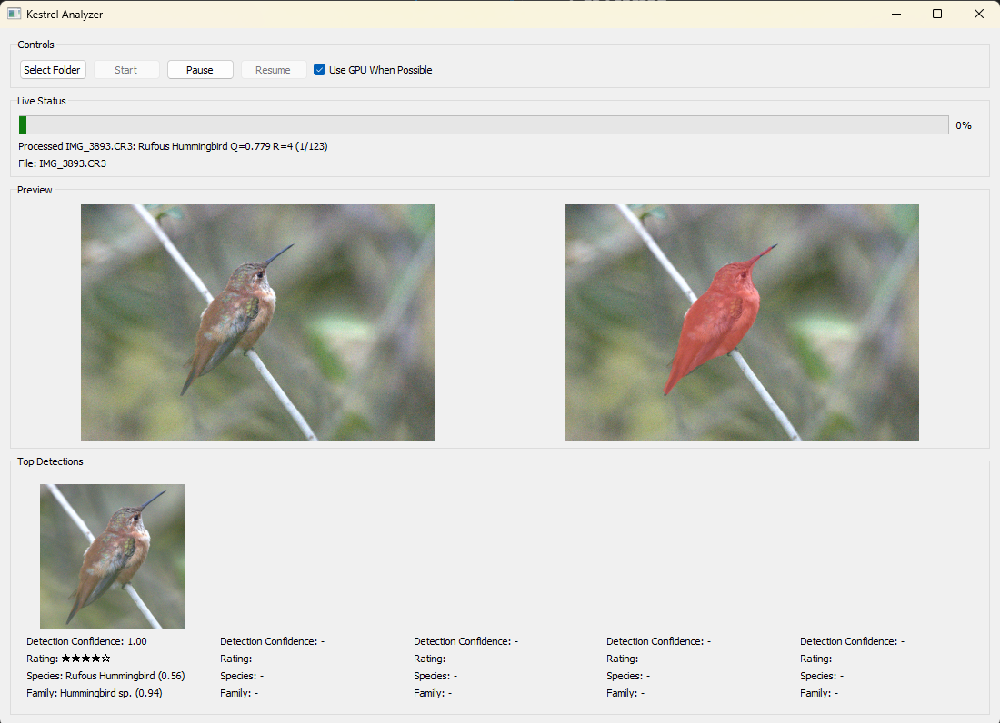
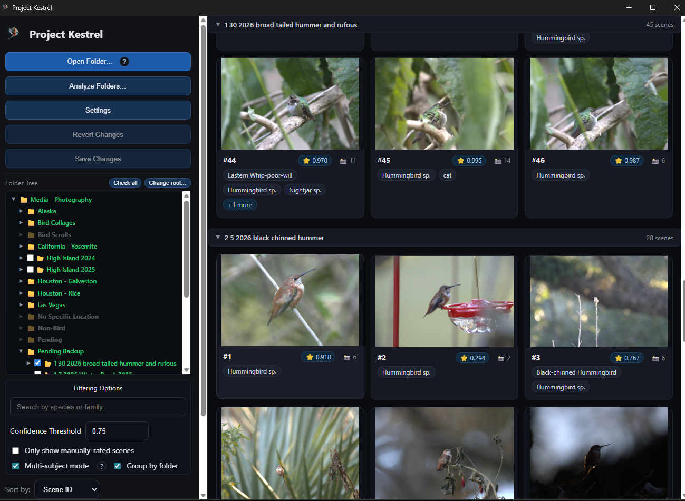
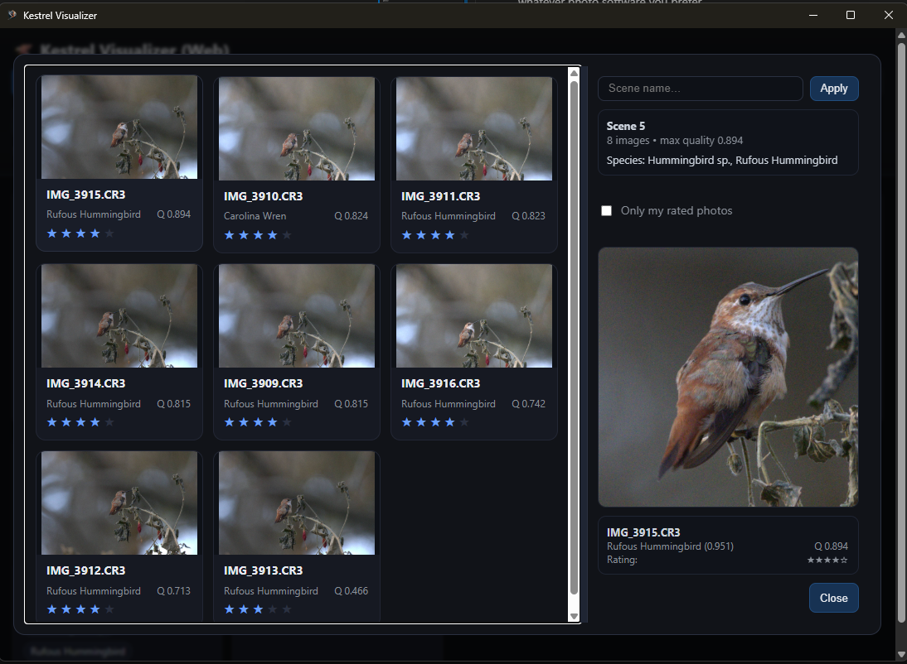
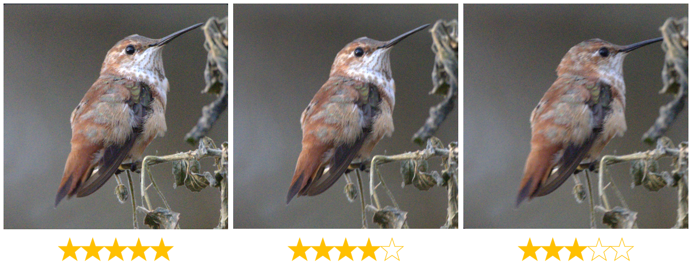
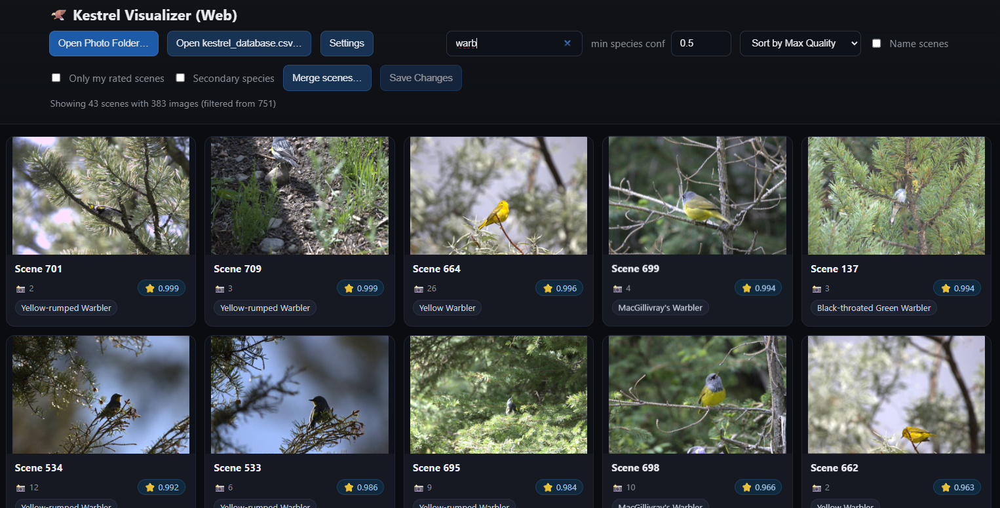
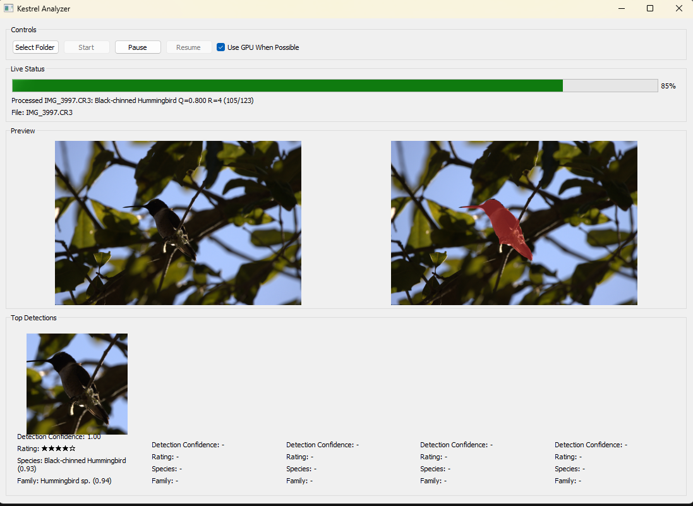
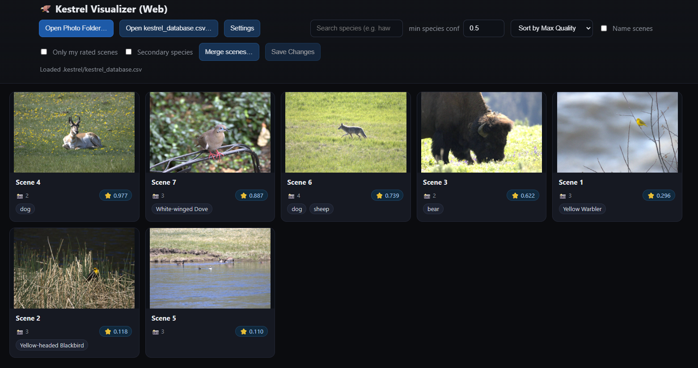

# Project Kestrel 🦅

Project Kestrel is a Machine Learning-powered bird photography analysis software that groups your burst photos together and ranks them by image quality. Let Kestrel move you from your RAW photo collection to a searchable, quality-sorted and interactive library, then take the last few steps to select your favorite photos to edit and share!


[Donate](https://www.paypal.com/donate/?hosted_button_id=CXH4FE5AKZD3A) | [Visit Projectkestrel.org](https://projectkestrel.org)

## At a Glance

Are you a bird photographer? Do you take hundreds or thousands of bird photos, often in bursts? How much time do you spend comparing your images to find the sharpest ones to edit and share?

Project Kestrel creates a searchable, quality-sorted, and easy-to-browse visualization of your bird photo collection. To do this, Kestrel first scans through your photos, grouping them together by scene/burst, and identifying birds in each photo. After that, it anazlyes the bird, identifying its family/species and estimating the **objective** image quality (sharpness, motion blur, and noise).

After Kestrel is done scanning, run the visualizer tool to intelligently browse through your photos. Search by species or family, and double-click on an image you like to launch it in your favorite photo editor (darktable, lightroom, etc.) 

✅ Kestrel is for:
* Hobbyist/Professional bird photographers who take **hundreds or thousands of photos in bursts.**
* Bird photographers who want to **retain control** and decision-making authority when selecting their favorite photos.
* Bird photographers who spend too much time painstakingly scrutinizing their images to find minor differences in sharpness, motion blur, or noise.

❌ Kestrel does NOT:
* Attempt to evaluate your photos on **subjective** characteristics (ex. bird pose, framing, etc.)
* Delete or modify any of your photos
* Do any processing in the cloud (All processing is done locally on your computer!)
* Collect or transmit any data about your photos.


## Get Started

Download the [latest release](https://github.com/SanjaySoniLV/ProjectKestrel/releases) for your platform! Windows and macOS users can simply download and run the installer or application. Once installed, run Kestrel Analyzer to analyze your photos. Once it is finished, run Kestrel Visualizer to browse your photos!

Linux users or those who prefer to run from source code should see the Quick Start section below.

## Gallery/Quick Tutorial

First, open Kestrel Analyzer. Kestrel will analyze all of your photos, spotting birds, checking their species, and estimating the objective image quality.


After Kestrel is done, it is time to launch the interactive visualizer. Search by bird species and click on a scene.


Simply double-click on a scene to view all your photos, sorted by quality! Find a pose you like? Double-click to open in darktable or whatever photo software you prefer.


Kestrel has sorted your photos from sharp to blurry. No more time painstakingly reviewing each bird!


You can even search by bird species! (Note: Species detection is experimental and may be incorrect.)



## Features

- **Automatic Bird Detection**: Kestrel will find exactly where the bird is in your photo
- **Family Classification**: Kestrel will guess the bird family (ex. Waterfowl, Hummingbirds, Sparrows) and species, allowing you to search your photos quickly!
- **Objective Quality Assessment**: Kestrel will analyze the quality of your photos based on sharpness, motion blur, and noise. It will NOT analyze your photos based on bird pose, framing, or other subjective characteristics.
- **Intelligent Organization**: Kestrel groups your photos by scene/burst, allowing you to compare all images of a given subject.
- **Responsive, Interactive Visualizer**: Browse Kestrel's results and double-click on photos to import into your preferred editing workflow.
- **RAW File Support**: Processes CR2, CR3, NEF, ARW, DNG, and other RAW formats using rawpy library

## 🚀 Quick Start

For the easiest setup, download the [latest release](https://github.com/SanjaySoniLV/ProjectKestrel/releases) for your platform. Windows and macOS executables are available!

### Running from Source (Linux or Development)

If you prefer to run Kestrel from source code or are on Linux, follow these steps:

#### Prerequisites
- Python 3.12+
- Git (for cloning)

#### Installation

1. Clone the repository with [Git](https://git-scm.com/):
```bash
git clone https://github.com/SanjaySoniLV/ProjectKestrel.git
cd ProjectKestrel
```
or simply download the Code as a .zip file and extract it.

2. Install dependencies:
```bash
pip install -r requirements.txt
```

### Usage

#### 1. Analyze a Photo Directory

First open the analyzer.

```bash
python analyzer/main.py
```

Select a folder and hit start. The script will:
- Process each image to detect birds, classify species, and assess quality
- Generate a database of results in `{your_photo_folder}/.kestrel/kestrel_database.csv`
- Create export JPEGs and cropped bird images



> Note: The script will take some time to run. All progress is saved automatically. If you encounter any errors, try re-running the script, and Kestrel will continue where it left off.

> Note: Kestrel comes with a set of test images. Simply open the `test_imgs` folder and hit Start. 

If you want to use a command line to analyze your photos, run:
```bash
python analyzer/cli.py "C:\\path\\to\\photos" --no-gpu
```

#### 2. Visualize Results

Launch the interactive visualizer to browse your analyzed photos:

```bash
python visualizer/visualizer.py
```

Open the folder that you analyzed to explore its contents and Kestrel's analysis:


Features of the visualizer:
- **Scene View**: Browse grouped similar images
- **Species Search**: Filter by bird species keywords
- **Quality Sorting**: Images automatically sorted by quality score
- **Detailed View**: Examine individual images with metadata
- **External Tools**: Open original files or simply double-click to launch Darktable

## How It Works

### 1. Bird Detection
- Uses PyTorch's Mask R-CNN ResNet50 FPN v2 model
- Detects and segments birds in images
- Generates precise masks to ensure image quality is assessed on bird pixels only, not background pixels.

### 2. Species Classification
- A custom machine learning model was trained for bird species identification for North American birds.
- Improvements to classification are planned.

### 3. Quality Assessment
- A custom machine learning model was trained to analyze the quality of the images.
- Factors in noise, motion blur, out-of-focus images, and other artifacts into one score.
- Only evaluates image regions corresponding to the bird, NOT any branches, backgrounds, or other regions.
- Quality scores are used to rank images within a scene by sharpness.

### 4. Scene Grouping
- A custom image similarity algorithm was developed to identify images that belong to the same scene.
- Bursts are automatically grouped together, allowing their relative quality to be ranked with ease.

## Project Structure

```
ProjectKestrel/
├── analyzer/                 # Analyzer app (GUI + CLI + core pipeline)
│   ├── gui_app.py            # PyQt GUI entry
│   ├── cli.py                # CLI entry
│   ├── main.py               # GUI entrypoint wrapper
│   ├── models/               # AI model files
│   └── kestrel_analyzer/     # Core pipeline + ML wrappers
├── visualizer/               # Visualizer app (local web server)
│   ├── visualizer.py         # Server entry
│   └── visualizer.html       # Web UI
├── packaging/                # PyInstaller specs for .exe builds
└── README.md
```

## Supported File Formats

Kestrel's quality scoring model is trained on RAW images, and may not work as well for JPG images (but can still be used). Kestrel uses rawpy to read RAW files. If your camera's RAW format is not listed below, please create a pull request, and we will add it to the list.

**RAW Formats** (preferred):
- Canon: `.cr2`, `.cr3`
- Nikon: `.nef`
- Sony: `.arw`
- Adobe: `.dng`
- Olympus: `.orf`
- Fuji: `.raf`
- Panasonic: `.rw2`
- Pentax: `.pef`
- Samsung: `.sr2`
- Sigma: `.x3f`

> Note: If this list does not support your camera's RAW file, please reach out via the email below. It is easy to add new RAW file formats thanks to the rawpy library.

**Standard Formats** (fallback):
- JPEG: `.jpg`, `.jpeg`
- PNG: `.png`

## 🔧 Configuration

### GPU Acceleration
When running the analyzer, you'll be prompted to choose between:
- **GPU Mode**: Uses DirectML on Windows (faster, requires compatible GPU and Windows OS)
- **CPU Mode**: Uses CPU execution provider (slightly, but works on all systems)

> NOTE: Not all models are run on the GPU, and GPU acceleration is in Beta development and may be unstable. If you run into errors or instability, please use CPU mode.

### Output Structure
Processed images are organized in a `.kestrel` folder within your photo directory:
```
your_photos/
├── .kestrel/
│   ├── export/           # Resized JPEG exports
│   ├── crop/            # Cropped bird images
│   └── kestrel_database.csv  # Analysis results
└── [your original photos]
```

The `.kestrel` folder will require an additional 1MB of disk space for every ~100MB of RAW files. This folder may also include error or warning logs.

### Building Logo Files (Development)

If you update the logo (`assets/logo.svg`), you can regenerate all logo assets (PNG, ICO, and Microsoft Store formats) using the build script:

```bash
cd assets
python build_logo_files.py
```

This script will:
- Convert `logo.svg` to `.ico` file
- Generate PNG files at various sizes (256×256, 44×44, 150×150, 310×310)
- Create Microsoft Store app package logos (StoreLogo, Wide310x150Logo, SplashScreen)
- Copy the generated `.ico` and `.svg` to the `analyzer/` directory

The script automatically installs required dependencies (cairosvg, Pillow) on first run and maintains the original SVG's aspect ratio when creating square logo variants.

## 🤝 Contributing

Contributions are welcome! Please feel free to submit pull requests, report bugs, or suggest features.

Donations are welcome. Please donate via [PayPal/Card](https://www.paypal.com/donate/?hosted_button_id=CXH4FE5AKZD3A)

## ❓ Contact Me
Direct questions or comments to [support@projectkestrel.org](mailto:support@projectkestrel.org)

## 📄 License

This project is licensed under the GPL v3 License - see the LICENSE file for details.

## 🙏 Acknowledgments

- **rawpy** library for robust RAW image file format handling
- **pyinstaller project** for robust python packaging and distribution solutions.

---

**Note**: This project is designed primarily for bird photography analysis. Functionality for other wildlife is in alpha stage, but will still function. Try it on your photos of wildlife!
